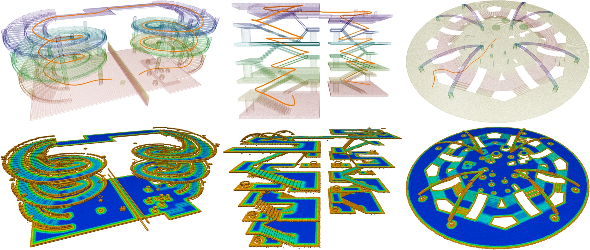

# PCT Planner

## Overview

This is an implementation of paper **Efficient Global Navigational Planning in 3-D Structures Based on Point Cloud Tomography** (accepted by TMECH).
It provides a highly efficient and extensible global navigation framework based on a tomographic understanding of the environment to navigate ground robots in multi-layer structures.

**Demonstrations**: [pct_planner](https://byangw.github.io/projects/tmech2024/)



## Citing

If you use PCT Planner, please cite the following paper:

[Efficient Global Navigational Planning in 3-D Structures Based on Point Cloud Tomography](https://ieeexplore.ieee.org/document/10531813)

```bibtex
@ARTICLE{yang2024efficient,
  author={Yang, Bowen and Cheng, Jie and Xue, Bohuan and Jiao, Jianhao and Liu, Ming},
  journal={IEEE/ASME Transactions on Mechatronics}, 
  title={Efficient Global Navigational Planning in 3-D Structures Based on Point Cloud Tomography}, 
  year={2024},
  volume={},
  number={},
  pages={1-12}
}
```

## Prerequisites

### Environment

- Ubuntu >= 20.04
- ROS >= Noetic with ros-desktop-full installation
- CUDA >= 11.7

### Python

- Python >= 3.8
- [CuPy](https://docs.cupy.dev/en/stable/install.html) with CUDA >= 11.7
- Open3d

## Build & Install

Inside the package, there are two modules: the point cloud tomography module for tomogram reconstruction (in **tomography/**) and the planner module for path planning and optimization (in **planner/**).
You only need to build the planner module before use.
In **planner/**, run **build_thirdparty.sh** first and then run **build.sh**. 

```bash
cd planner/
./build_thirdparty.sh
./build.sh
```

## Run Examples

Three example scenarios are provided: **"Spiral"**, **"Building"**, and **"Plaza"**.
- **"Spiral"**: A spiral overpass scenario released in the [3D2M planner](https://github.com/ZJU-FAST-Lab/3D2M-planner).
- **"Building"**: A multi-layer indoor scenario with various stairs, slopes, overhangs and obstacles.
- **"Plaza"**: A complex outdoor plaza for repeated trajectory generation evaluation.

### Tomogram Construction

To plan in a scenario, first you need to construct the scene tomogram using the pcd file.
- Unzip the pcd files in **rsc/pcd/pcd_files.zip** to **rsc/pcd/**.
- For scene **"Spiral"**, you can download the pcd file from [3D2M planner spiral0.3_2.pcd](https://github.com/ZJU-FAST-Lab/3D2M-planner/tree/main/planner/src/read_pcd/PCDFiles).
- Run **roscore**, start **RViz** with the provided config (**rsc/rviz/pct_ros.rviz**). 
- In **tomography/scripts/**, run **tomography.py** with the **--scene** argument:

```bash
cd tomography/scripts/
python3 tomography.py --scene Spiral
```

- The generated tomogram is visualized as ROS PointCloud2 message in RViz and saved in **rsc/tomogram/**.

### Trajectory Generation 

After the tomogram is constructed, you can run the trajectory generation example.
- In **planner/scripts/**, run **plan.py** with the **--scene** argument:

```bash
export LD_LIBRARY_PATH=$LD_LIBRARY_PATH:/YOUR/DIRECTORY/TO/PCT_planner/planner/lib/3rdparty/gtsam-4.1.1/install/lib
cd planner/scripts/
python3 plan.py --scene Spiral
```

- The generated trajectory is visualized as ROS Path message in RViz.

## License

The source code is released under [GPLv2](http://www.gnu.org/licenses/) license.

For commercial use, please contact Bowen Yang [byangar@connect.ust.hk](mailto:byangar@connect.ust.hk).